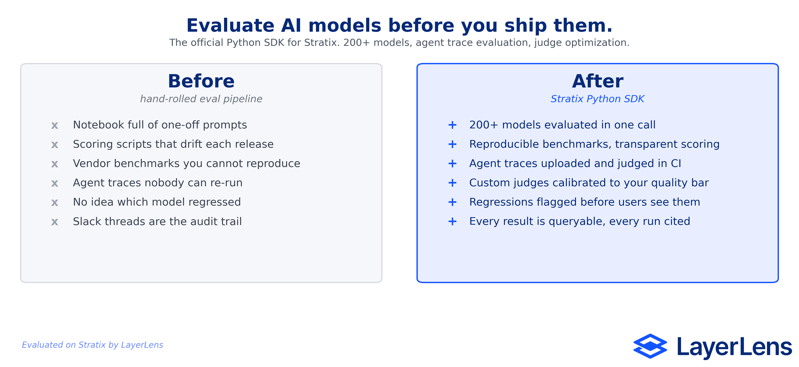

<div align="center">

# Stratix Python SDK

### Evaluate AI models before you ship them.

The official Python SDK for [Stratix by LayerLens](https://stratix.layerlens.ai). Run reproducible benchmarks across 200+ models, evaluate agent traces, calibrate custom judges, and catch silent regressions, all from Python or your CI pipeline.

**213 public models · 59 benchmarks · 26 model providers · 180,000+ benchmark prompts**

[](https://sdk.layerlens.ai/package)
[](https://www.python.org/downloads/)
[](https://opensource.org/licenses/Apache-2.0)
[](https://github.com/LayerLens/stratix-python)

[**Web app**](https://stratix.layerlens.ai) · [**Docs**](https://layerlens.gitbook.io/stratix-python-sdk) · [**Discord**](https://discord.gg/layerlens) · [**Star the repo if you run your first eval in under 2 minutes ⭐**](https://github.com/LayerLens/stratix-python)



</div>

---

## Why Stratix

Hand-rolled eval pipelines drift. Vendor leaderboards are not reproducible. Production agents fail silently and nobody knows which release introduced the regression.

Stratix is the continuous evaluation infrastructure for AI. The SDK gives you:

- **Ship reliable agents faster.** Run any of 200+ public models against any benchmark in a few lines of Python. No scaffolding, no glue code.
- **Catch silent regressions before users do.** Wire evals into CI and fail builds on quality drops, not just on red unit tests.
- **Stop hand-rolling judges.** Define a quality goal in plain English. Stratix calibrates a judge to that goal and reuses it across runs.
- **Evaluate full agent traces, not just outputs.** Upload trace files and score multi-step behavior, not just the last token.
- **Reproducible by default.** Every score is backed by a verifiable trace you can re-run, inspect, and cite.

> 60-second product walkthrough → *coming soon. Star the repo to be notified when it lands.*

## Quick Start

### Install

```bash
pip install layerlens --extra-index-url https://sdk.layerlens.ai/package
```

### Authenticate

```bash
export LAYERLENS_STRATIX_API_KEY="your-api-key"
```

Or pass the key directly:

```python
from layerlens import Stratix
client = Stratix(api_key="your-api-key")
```

### Run your first eval

```python
import os
from layerlens import Stratix

client = Stratix(api_key=os.environ.get("LAYERLENS_STRATIX_API_KEY"))

model = client.models.get_by_key("openai/gpt-4o")
benchmark = client.benchmarks.get_by_key("arc-agi-2")

evaluation = client.evaluations.create(model=model, benchmark=benchmark)
result = client.evaluations.wait_for_completion(evaluation)

print(f"Accuracy: {result.accuracy}")
```

That is the full path from `pip install` to a verifiable benchmark score. **If it took you under 2 minutes, [star the repo](https://github.com/LayerLens/stratix-python).**

### Async usage

```python
import os, asyncio
from layerlens import AsyncStratix

async def main():
    client = AsyncStratix(api_key=os.environ.get("LAYERLENS_STRATIX_API_KEY"))
    model = await client.models.get_by_key("openai/gpt-4o")
    benchmark = await client.benchmarks.get_by_key("arc-agi-2")
    evaluation = await client.evaluations.create(model=model, benchmark=benchmark)
    result = await client.evaluations.wait_for_completion(evaluation)
    print(f"Accuracy: {result.accuracy}")

asyncio.run(main())
```

## How Stratix Fits in Your Stack

```
   your code  ─────────►  Stratix SDK  ─────────►  Stratix platform
   (CI / app)             (this repo)              (200+ models, judges,
                                                    benchmarks, trace evals)
                                                          │
                                                          ▼
                                            results, traces, audit records
                                                  in the web app at
                                              stratix.layerlens.ai
```

The SDK is the programmatic surface. The [web app](https://stratix.layerlens.ai) is where humans inspect runs, share comparisons, and manage judges.

## Resources

| Resource                     | What it does                                                                  |
| ---------------------------- | ----------------------------------------------------------------------------- |
| `client.models`              | Manage models (get, get_by_key, add, remove, create_custom)                   |
| `client.benchmarks`          | Manage benchmarks (get, get_by_key, add, remove, create_custom, create_smart) |
| `client.evaluations`         | Create evaluations and wait for results                                       |
| `client.judges`              | CRUD operations for evaluation judges                                         |
| `client.traces`              | Upload trace files and manage traces                                          |
| `client.trace_evaluations`   | Run trace-level evaluations with judges                                       |
| `client.judge_optimizations` | Optimize judge configurations                                                 |
| `client.results`             | Retrieve evaluation results                                                   |
| `client.public`              | Public models, benchmarks, evaluations, and comparisons                       |

Every resource is available in both sync (`Stratix`) and async (`AsyncStratix`) clients.

## Examples

### Working with judges

```python
judge = client.judges.create(
    name="Response Quality Judge",
    evaluation_goal="Rate whether the response is accurate, complete, and well-structured",
)

response = client.judges.get_many()
for j in response.judges:
    print(f"{j.name} (id: {j.id})")

client.judges.update(judge.id, name="Updated Judge Name")
client.judges.delete(judge.id)
```

### Uploading and evaluating traces

Trace upload works with JSON or JSONL files (up to 50 MB). The SDK handles presigned S3 uploads automatically.

```python
result = client.traces.upload("./my_traces.json")
print(f"Uploaded trace IDs: {result.trace_ids}")

traces = client.traces.get_many()
for t in traces.traces:
    print(f"Trace {t.id}")

trace_eval = client.trace_evaluations.create(trace_id=t.id, judge_id=judge.id)
results = client.trace_evaluations.get_results(trace_eval.id)
```

### Custom models

Custom models require an OpenAI-compatible API endpoint.

```python
response = client.models.create_custom(
    name="My Fine-tuned Model",
    key="my-org/custom-model-v1",
    description="Fine-tuned GPT for medical Q&A",
    api_url="https://my-api.example.com/v1",
    max_tokens=4096,
    api_key=os.environ.get("MY_PROVIDER_API_KEY"),  # optional
)
print(f"Created model: {response.model_id}")
```

### Public endpoints

Public models, benchmarks, and evaluations are accessible through `client.public`. The public client still requires an API key.

```python
import os
from layerlens import Stratix

client = Stratix(api_key=os.environ.get("LAYERLENS_STRATIX_API_KEY"))

models = client.public.models.get()
for model in models.models:
    print(f"{model.key}: {model.name}")
```

Or instantiate the public client directly:

```python
from layerlens import PublicClient

public = PublicClient(api_key=os.environ.get("LAYERLENS_STRATIX_API_KEY"))
models = public.models.get()
```

## CLI

The LayerLens CLI lets you manage traces, judges, evaluations, integrations, and more from the terminal.

```bash
pip install layerlens[cli] --extra-index-url https://sdk.layerlens.ai/package
export LAYERLENS_STRATIX_API_KEY="your-api-key"

stratix --help                      # Show all commands
stratix trace list                  # List traces
stratix evaluate run \
  --model openai/gpt-4o \
  --benchmark arc-agi-2 --wait      # Run an evaluation and wait for results
stratix judge create \
  --name "Quality" \
  --goal "Rate response quality" \
  --model-id <MODEL_ID>             # Create a judge
stratix ci report -o summary.md     # Generate CI report
```

Shell completions are available for bash, zsh, fish, and powershell:

```bash
stratix completion bash             # Print setup instructions
```

Full CLI docs: [docs/cli/](docs/cli/)

| Guide                                          | Description                                          |
| ---------------------------------------------- | ---------------------------------------------------- |
| [Getting Started](docs/cli/getting-started.md) | Installation, configuration, first commands          |
| [Command Reference](docs/cli/commands.md)      | All commands and options                             |
| [Examples](docs/cli/examples.md)               | 15 common workflows as copy-paste shell sessions     |

## Configuration

| Environment Variable         | Description               | Default                           |
| ---------------------------- | ------------------------- | --------------------------------- |
| `LAYERLENS_STRATIX_API_KEY`  | Your API key              | (required)                        |
| `LAYERLENS_STRATIX_BASE_URL` | Override the API base URL | `https://api.layerlens.ai/api/v1` |

Legacy env vars (`LAYERLENS_ATLAS_API_KEY`, `LAYERLENS_ATLAS_BASE_URL`) are also supported.

## Requirements

- Python 3.8+
- Dependencies: `httpx`, `pydantic`, `requests`
- CLI extra: `click>=8.0.0`

## Documentation

Full API reference and examples are available in the [docs/](docs/) directory:

- [CLI Guide](docs/cli/) (getting started, command reference, workflow examples)
- [API Reference](docs/api-reference/) (client config, all resource methods, error handling)
- [Code Examples](docs/examples/) (evaluations, judges, traces)
- [Troubleshooting](docs/troubleshooting/) (auth issues, error codes)

---

## Reference

### Error handling

The SDK raises typed exceptions for API errors. Catch the most specific exception first.

```python
import os
from layerlens import Stratix, StratixError, APIError, BadRequestError, NotFoundError

client = Stratix(api_key=os.environ.get("LAYERLENS_STRATIX_API_KEY"))

try:
    result = client.models.get_by_id("nonexistent-id")
except NotFoundError as e:
    print(f"Not found (HTTP {e.status_code}): {e.message}")
except BadRequestError as e:
    print(f"Bad request: {e.message}")
except APIError as e:
    print(f"API error: {e.message}")
except StratixError as e:
    print(f"Client error: {e}")
```

The full exception hierarchy:

- `StratixError` (base for all SDK errors)
  - `APIError` (base for all API-related errors)
    - `APIConnectionError` (network issues)
      - `APITimeoutError` (request timed out)
    - `APIResponseValidationError` (response did not match expected schema)
    - `APIStatusError` (HTTP 4xx/5xx)
      - `BadRequestError` (400)
      - `AuthenticationError` (401)
      - `PermissionDeniedError` (403)
      - `NotFoundError` (404)
      - `ConflictError` (409)
      - `UnprocessableEntityError` (422)
      - `RateLimitError` (429)
      - `InternalServerError` (500+)

Note: only `StratixError`, `APIError`, `BadRequestError`, `AuthenticationError`, and `NotFoundError` are exported from the top-level package. For other exception types, import from `layerlens._exceptions`.

### Client aliases

For backward compatibility, multiple import names are available:

```python
from layerlens import Stratix          # Primary
from layerlens import AsyncStratix     # Async primary
from layerlens import Client           # Alias for Stratix
from layerlens import AsyncClient      # Alias for AsyncStratix
from layerlens import Atlas            # Legacy alias
from layerlens import AsyncAtlas       # Legacy alias
from layerlens import PublicClient     # Public endpoints
from layerlens import AsyncPublicClient
```

---

## Get help

Hit a wall? You have three options:

- **Discord:** [discord.gg/layerlens](https://discord.gg/layerlens) is the fastest path to a human. Most questions answered same day.
- **Issues:** [Open a GitHub issue](https://github.com/LayerLens/stratix-python/issues) for bugs, feature requests, and SDK-specific discussion.
- **Docs:** [Full SDK reference on GitBook](https://layerlens.gitbook.io/stratix-python-sdk).

## Contributing

Pull requests welcome. For larger changes, open an issue first so we can talk through the design.

## License

Apache 2.0. See [LICENSE](LICENSE) for details.

---

<div align="center">

**If this SDK saved you time, [⭐ star the repo](https://github.com/LayerLens/stratix-python).**

That is how more developers find Stratix.

[Website](https://layerlens.ai) · [Web app](https://stratix.layerlens.ai) · [Discord](https://discord.gg/layerlens) · [Docs](https://layerlens.gitbook.io/stratix-python-sdk)

</div>
