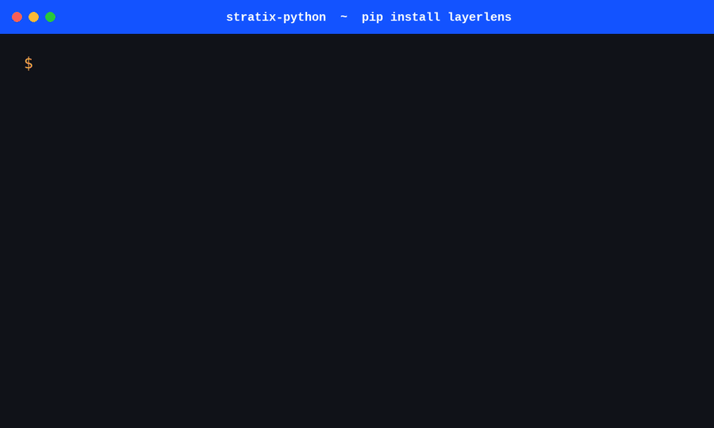

<div align="center">

# Stratix Python SDK

### Evaluate AI models before you ship them.

The official Python SDK for [Stratix by LayerLens](https://stratix.layerlens.ai). Run reproducible benchmarks across 200+ models, evaluate agent traces, calibrate custom judges, and catch silent regressions, all from Python or your CI pipeline.

**213 public models · 59 benchmarks · 26 model providers · 180,000+ benchmark prompts**

<sub>Live counts from the Stratix public registry. Pulled at SDK build time, refreshed on every release.</sub>

[](https://pypi.org/project/layerlens/)
[](https://pypi.org/project/layerlens/)
[](https://www.python.org/downloads/)
[](https://github.com/LayerLens/stratix-python/actions/workflows/run-tests.yaml)
[](https://opensource.org/licenses/Apache-2.0)
[](https://github.com/LayerLens/stratix-python)

[**Browse 213 models →**](https://stratix.layerlens.ai) ·
[**Docs**](https://layerlens.gitbook.io/stratix-python-sdk) ·
[**Discord**](https://discord.gg/layerlens) ·
[**Blog**](https://layerlens.ai/blog) ·
[**Issues**](https://github.com/LayerLens/stratix-python/issues)


[**Run your first eval**](#quick-start) · [**Browse 213 models**](https://stratix.layerlens.ai) · [**Star if useful ⭐**](https://github.com/LayerLens/stratix-python)

</div>

---

<div align="center">
  
  <p><sub><i>Vendor-neutral evals in 5 lines of Python.</i></sub></p>
</div>

---

## Why Stratix

Hand-rolled eval pipelines drift. Vendor leaderboards are not reproducible. Production agents fail silently and nobody knows which release introduced the regression.

<table>
<tr>
<td width="33%" valign="top">

### Vendor-neutral
Stratix is not owned by a model provider. The same benchmark runs across 213 public models from 26 providers in one workspace. No labs grading their own homework. No leaderboards optimized for marketing.

</td>
<td width="33%" valign="top">

### Reproducible by default
Every score is backed by a verifiable, persisted trace you can re-run, inspect, and cite. Same prompt, same prompt template, same scoring logic, same model version. Every time.

</td>
<td width="33%" valign="top">

### Production-ready
Wire evals into CI. Calibrate judges to a quality goal in plain English. Score full agent traces, not just last-token outputs. Ship reliable agents faster.

</td>
</tr>
</table>

---

## Quick Start

Three steps. Under two minutes if you already have an API key.

```bash
pip install layerlens
```

```python
from layerlens import Stratix

# Auth via env (LAYERLENS_STRATIX_API_KEY) or kwarg
client = Stratix(api_key="your-api-key")

# Pick a model + benchmark from the public registry
model = client.models.get_by_key("openai/gpt-5.4")
benchmark = client.benchmarks.get_by_key("aime2026")

# Run the evaluation
evaluation = client.evaluations.create(model=model, benchmark=benchmark)
result = client.evaluations.wait_for_completion(evaluation.id)

print(f"accuracy: {result.accuracy}")
print(f"view: https://stratix.layerlens.ai/evaluations/{result.id}")
```

**If that worked end-to-end in under two minutes, [star the repo](https://github.com/LayerLens/stratix-python). Helps more teams find Stratix.**

[Get an API key →](https://stratix.layerlens.ai) · [Full Quick Start docs →](https://layerlens.gitbook.io/stratix-python-sdk/getting-started)

---

## Install

<table width="100%">
<tr>
<th width="34%">Standard (pip)</th>
<th width="33%">Modern (uv)</th>
<th width="33%">Authenticate</th>
</tr>
<tr valign="top">
<td>

```bash
pip install layerlens
```

</td>
<td>

```bash
uv pip install layerlens
```

</td>
<td>

```bash
export LAYERLENS_STRATIX_API_KEY=...
```

Or pass `api_key=...` to the client.

</td>
</tr>
</table>

Requires Python 3.8+. Free tier available at [stratix.layerlens.ai](https://stratix.layerlens.ai). Browse all 213 models and 59 benchmarks before you sign up.

---

## Capabilities

Six capabilities, one SDK, one feedback loop.

<table>
<tr>
<td width="33%" valign="top">

### Model evaluation
Run any of 213 public models across 59 benchmarks. AIME, GPQA, ARC-AGI-2, HumanEval, Terminal-Bench, MMLU Pro, BIRD-CRITIC, more. Reasoning, coding, math, agentic, multilingual.

<sub>[Docs →](https://layerlens.gitbook.io/stratix-python-sdk)</sub>

</td>
<td width="33%" valign="top">

### Agent trace evaluation
Upload OpenAI-format trace files and score multi-step agent behavior. Tool use, planning quality, recovery from failures. Not just the final token.

<sub>[Docs →](https://layerlens.gitbook.io/stratix-python-sdk)</sub>

</td>
<td width="33%" valign="top">

### Judge calibration
Define a quality goal in plain English. Stratix calibrates an LLM-as-judge to that goal, validates against your gold examples, and reuses the judge across runs.

<sub>[Docs →](https://layerlens.gitbook.io/stratix-python-sdk)</sub>

</td>
</tr>
<tr>
<td width="33%" valign="top">

### Custom benchmarks
Bring your own dataset. Smart benchmark generation for adversarial cases, edge inputs, and domain-specific evals. Reuses public scoring infrastructure.

<sub>[Docs →](https://layerlens.gitbook.io/stratix-python-sdk)</sub>

</td>
<td width="33%" valign="top">

### CI integration
Fail the build on quality regressions, not just on red unit tests. Use `stratix ci report` in GitHub Actions, GitLab CI, CircleCI, or any Python-capable runner.

<sub>[Sample →](./samples/cicd)</sub>

</td>
<td width="33%" valign="top">

### Reproducible runs
Every evaluation persists model version, prompt template, judge config, and full traces. Re-run any evaluation by ID. Cite the result with confidence.

<sub>[Docs →](https://layerlens.gitbook.io/stratix-python-sdk)</sub>

</td>
</tr>
</table>

---

## Hand-rolled vs. Stratix

The same task: score GPT-5.4 against AIME 2026 and store the results.

<table width="100%">
<tr>
<th width="50%">Hand-rolled (typical)</th>
<th width="50%">Stratix</th>
</tr>
<tr valign="top">
<td>

```python
import openai, json, asyncio
from datasets import load_dataset

ds = load_dataset("aime-2026")["test"]
client = openai.OpenAI()

results = []
async def score_one(item):
    resp = await client.chat.completions.create(
        model="gpt-5.4",
        messages=[{"role":"user","content":item["q"]}],
    )
    answer = parse_answer(resp.choices[0].message.content)
    return {"q": item["q"], "ans": answer, "expected": item["a"],
            "correct": answer == item["a"]}

# Implement: rate limiting, retries, cost tracking,
# trace storage, judge logic, schema versioning,
# benchmark drift detection, regression alerting.
# Repeat per benchmark. Per model. Per release.
```

</td>
<td>

```python
from layerlens import Stratix

client = Stratix()  # reads LAYERLENS_STRATIX_API_KEY

evaluation = client.evaluations.create(
    model=client.models.get_by_key("openai/gpt-5.4"),
    benchmark=client.benchmarks.get_by_key("aime2026"),
)
result = client.evaluations.wait_for_completion(evaluation.id)

print(result.accuracy)
print(f"https://stratix.layerlens.ai/evaluations/{result.id}")
```

</td>
</tr>
</table>

---

## How Stratix compares

<table width="100%">
<thead>
<tr>
<th width="28%"></th>
<th width="14%" align="center"><b>Stratix</b></th>
<th width="14%" align="center">Braintrust</th>
<th width="14%" align="center">LangSmith</th>
<th width="14%" align="center">Phoenix</th>
<th width="16%" align="center">OpenAI Evals</th>
</tr>
</thead>
<tbody>
<tr><td>Public-model leaderboard</td><td align="center">213</td><td align="center">none</td><td align="center">none</td><td align="center">none</td><td align="center">limited</td></tr>
<tr><td>Independent grading</td><td align="center">✅</td><td align="center">✅</td><td align="center">✅</td><td align="center">✅</td><td align="center">⚠️ vendor</td></tr>
<tr><td>Reproducible scores</td><td align="center">✅<br><sub>traces persisted</sub></td><td align="center">✅</td><td align="center">✅</td><td align="center">✅</td><td align="center">✅</td></tr>
<tr><td>Agent trace evaluation</td><td align="center">✅</td><td align="center">✅</td><td align="center">✅</td><td align="center">✅</td><td align="center">⚠️</td></tr>
<tr><td>Judge calibration in SDK</td><td align="center">✅</td><td align="center">✅</td><td align="center">⚠️</td><td align="center">⚠️</td><td align="center">⚠️</td></tr>
<tr><td>Custom benchmarks</td><td align="center">✅</td><td align="center">✅</td><td align="center">✅</td><td align="center">✅</td><td align="center">✅</td></tr>
<tr><td>Smart benchmark generation</td><td align="center">✅</td><td align="center">via templates</td><td align="center">via templates</td><td align="center">manual</td><td align="center">manual</td></tr>
<tr><td>59 prebuilt benchmarks out of the box</td><td align="center">✅</td><td align="center">via templates</td><td align="center">via templates</td><td align="center">via Arize</td><td align="center">small core set</td></tr>
</tbody>
</table>

<sub>Comparison based on publicly documented features as of April 2026. Corrections welcome via issue or PR.</sub>

---

## Built for every kind of evaluation

Teams use Stratix to:

- **Pick the right model.** Compare 213 candidate models against your benchmark of choice before locking a vendor.
- **Lock in CI.** Wire the SDK into your test suite. Fail builds on quality drops, not just code regressions.
- **Audit production agents.** Score full agent traces against custom judges that match your quality bar.
- **Generate adversarial datasets.** Use smart benchmark generation to surface edge cases your manual tests missed.
- **Prove model claims.** Cite a reproducible Stratix score in security reviews, customer pitches, and compliance audits.
- **Replace hand-rolled eval pipelines.** Stop maintaining bespoke scripts that drift with every release.

---

## Cite, share, embed

Every evaluation has a stable URL. Paste it in a paper, a blog post, a security review, or a tweet. Anyone with the link can inspect the prompts, the judge, the traces, and the score.

```
https://stratix.layerlens.ai/evaluations/<evaluation-id>
```

Compare two models on the same benchmark, share the link:

```
https://stratix.layerlens.ai/compare?models=openai/gpt-5.4,anthropic/claude-4.6-sonnet&benchmark=aime2026
```

Tweet template after a run:

> Just ran `<model>` on `<benchmark>`. Score: `<accuracy>`. Reproducible trace: `<url>`. Built on @LayerLens_AI Stratix.

---

## CI in 30 seconds

Use the SDK in any GitHub Actions workflow. Fail the build on quality drops, not just unit-test red.

```yaml
- name: Run Stratix evals
  run: |
    pip install layerlens
    stratix evaluate run --model openai/gpt-5.4 --benchmark aime2026 --wait
    stratix ci report >> $GITHUB_STEP_SUMMARY
  env:
    LAYERLENS_STRATIX_API_KEY: ${{ secrets.LAYERLENS_STRATIX_API_KEY }}
```

The CI report renders directly in the GitHub Actions job summary. No custom action required.

---

## CLI

The `layerlens` package ships with a `stratix` (and `layerlens`) CLI for one-line evaluations from your terminal.

```bash
# Set API key once
export LAYERLENS_STRATIX_API_KEY=your-api-key

# Run an evaluation and wait for results
stratix evaluate run --model openai/gpt-5.4 --benchmark aime2026 --wait

# List evaluations, filter and sort
stratix evaluate list --status success --sort-by accuracy --order desc
stratix evaluate get <evaluation-id>

# Generate a CI summary report
stratix ci report --output summary.md

# Manage traces, judges, scorers, integrations
stratix trace --help
stratix judge --help
stratix scorer --help
stratix integration --help

# Shell completion (bash/zsh/fish)
stratix completion bash
```

[Full CLI reference →](https://layerlens.gitbook.io/stratix-python-sdk/cli)

---

## Architecture

Stratix sits between your code and any model provider. Every score is backed by a stored trace.

```
   your code / agent / CI pipeline
              │
              ▼
       ┌──────────────┐
       │  layerlens   │  ◄── Python SDK + CLI
       │     SDK      │
       └──────┬───────┘
              │  HTTPS
              ▼
   ┌────────────────────────┐
   │   Stratix platform     │
   │  ┌──────────────────┐  │
   │  │ model gateway    │  │ ─► OpenAI · Anthropic · Google · xAI · Moonshot · 22 more
   │  ├──────────────────┤  │
   │  │ benchmark engine │  │ ─► 59 benchmarks · 180k+ prompts
   │  ├──────────────────┤  │
   │  │ judge calibrator │  │ ─► LLM-as-judge + heuristic + ML
   │  ├──────────────────┤  │
   │  │ trace store      │  │ ─► reproducible per-run artifacts
   │  └──────────────────┘  │
   └────────────────────────┘
```

---

## Examples

| File | What it shows |
|---|---|
| [`samples/core/quickstart.py`](./samples/core/quickstart.py) | First evaluation in 10 lines |
| [`samples/core/trace_evaluation.py`](./samples/core/trace_evaluation.py) | Score a multi-step agent trace |
| [`samples/core/judge_optimization.py`](./samples/core/judge_optimization.py) | Calibrate an LLM-as-judge to a quality goal |
| [`samples/core/custom_benchmark.py`](./samples/core/custom_benchmark.py) | Bring your own dataset |
| [`samples/cicd/github_actions_gate.yml`](./samples/cicd/github_actions_gate.yml) | Fail CI on quality regressions |
| [`samples/`](./samples) | Full samples tree: cicd, claude-code, cli, copilotkit, integrations, mcp, modalities, more |

**Build something with Stratix in 30 minutes.** Pick a target model, run it against a benchmark you care about, and post the URL in [Discord](https://discord.gg/layerlens) or tag [@LayerLens_AI](https://x.com/LayerLens_AI).

---

## Handling errors

Connection failures (network, timeout) raise a subclass of `APIConnectionError`. API errors (4xx/5xx) raise a subclass of `APIStatusError` with `.status_code` and `.response`. Everything inherits from `StratixError`.

```python
from layerlens import (
    Stratix,
    APIConnectionError,
    APIStatusError,
    RateLimitError,
)

client = Stratix()

try:
    client.evaluations.create(model=..., benchmark=...)
except APIConnectionError as e:
    print(f"could not reach Stratix: {e.__cause__}")
except RateLimitError:
    print("429: back off and retry")
except APIStatusError as e:
    print(f"{e.status_code}: {e.response}")
```

| Status | Error |
|---|---|
| 400 | `BadRequestError` |
| 401 | `AuthenticationError` |
| 403 | `PermissionDeniedError` |
| 404 | `NotFoundError` |
| 409 | `ConflictError` |
| 422 | `UnprocessableEntityError` |
| 429 | `RateLimitError` |
| 5xx | `InternalServerError` |
| n/a | `APIConnectionError`, `APITimeoutError` |

---

## Configuration

<table width="100%">
<tr>
<th width="50%">Context manager (sync)</th>
<th width="50%">Context manager (async)</th>
</tr>
<tr valign="top">
<td>

```python
from layerlens import Stratix

with Stratix() as client:
    eval = client.evaluations.create(...)
# HTTP connection released
```

</td>
<td>

```python
import asyncio
from layerlens import AsyncStratix

async def main():
    async with AsyncStratix() as client:
        eval = await client.evaluations.create(...)

asyncio.run(main())
```

</td>
</tr>
</table>

```python
import httpx
from layerlens import Stratix

# Configure the default for all requests
client = Stratix(
    api_key="...",
    base_url="https://stratix.layerlens.ai",
    timeout=httpx.Timeout(60.0, read=30.0, connect=5.0),  # default: 600s read
)

# Override per-request
client.with_options(timeout=5.0).evaluations.create(...)
```

The `LAYERLENS_STRATIX_API_KEY` and `LAYERLENS_STRATIX_BASE_URL` environment variables are read automatically when no kwarg is passed.

---

## Reference

<details><summary><b>Client classes and aliases</b></summary>

`Stratix` is the canonical synchronous client. `AsyncStratix` is the async counterpart. The legacy `Client` and `AsyncClient` aliases are kept for backward compatibility.

```python
from layerlens import Stratix, AsyncStratix
from layerlens import Client, AsyncClient    # aliases (deprecated, kept for compat)
from layerlens import PublicClient           # read-only, unauthenticated public API
from layerlens import Atlas, AsyncAtlas      # Atlas product client (separate platform)
```

</details>

<details><summary><b>Async client</b></summary>

Every method on `Stratix` has an `AsyncStratix` counterpart with the same signature and `await`-able returns.

```python
import asyncio
from layerlens import AsyncStratix

async def main():
    async with AsyncStratix() as client:
        evaluation = await client.evaluations.create(
            model=await client.models.get_by_key("openai/gpt-5.4"),
            benchmark=await client.benchmarks.get_by_key("aime2026"),
        )
        result = await client.evaluations.wait_for_completion(evaluation.id)
        print(result.accuracy)

asyncio.run(main())
```

</details>

<details><summary><b>Error hierarchy</b></summary>

```
StratixError
├── AtlasError
└── APIError
    ├── APIConnectionError
    │   └── APITimeoutError
    ├── APIResponseValidationError
    └── APIStatusError
        ├── BadRequestError          (400)
        ├── AuthenticationError      (401)
        ├── PermissionDeniedError    (403)
        ├── NotFoundError            (404)
        ├── ConflictError            (409)
        ├── UnprocessableEntityError (422)
        ├── RateLimitError           (429)
        └── InternalServerError      (5xx)
```

```python
from layerlens import (
    StratixError, APIError,
    APIConnectionError, APITimeoutError,
    APIStatusError,
    BadRequestError, AuthenticationError, PermissionDeniedError,
    NotFoundError, ConflictError, UnprocessableEntityError,
    RateLimitError, InternalServerError,
)
```

</details>

<details><summary><b>Environment variables</b></summary>

| Variable | Purpose |
|---|---|
| `LAYERLENS_STRATIX_API_KEY` | API key (required if not passed to client) |
| `LAYERLENS_STRATIX_BASE_URL` | Override base URL (default: `https://stratix.layerlens.ai`) |

</details>

<details><summary><b>Resources on the Stratix client</b></summary>

| Resource | What it does |
|---|---|
| `client.models` | Add, remove, list, fetch models in your project |
| `client.benchmarks` | Add, remove, list, fetch benchmarks (including custom and smart) |
| `client.evaluations` | Run model-against-benchmark evaluations |
| `client.trace_evaluations` | Score uploaded agent traces against judges |
| `client.judges` | Create, update, delete custom LLM-as-judge configs |
| `client.judge_optimizations` | Calibrate a judge to a quality goal, then apply |
| `client.scorers` | Heuristic and ML scorer registry |
| `client.traces` | Upload, list, fetch agent trace artifacts |
| `client.evaluation_spaces` | Group related evaluations into a project space |
| `client.integrations` | Manage CI / webhook / SSO integrations |
| `client.results` | Fetch raw evaluation results (for ETL) |
| `client.public` | Public read-only access (no auth required) |

</details>

---

## Get help

| | |
|---|---|
| 💬 [**Discord**](https://discord.gg/layerlens) | Real-time help from the team and community |
| 🐛 [**GitHub Issues**](https://github.com/LayerLens/stratix-python/issues) | Bug reports, feature requests, design questions |
| 📖 [**Docs**](https://layerlens.gitbook.io/stratix-python-sdk) | Full SDK reference + cookbooks |
| 🌐 [**Web app**](https://stratix.layerlens.ai) | Browse 213 models, 59 benchmarks, run evals from the UI |
| 📺 [**YouTube**](https://www.youtube.com/@LayerLens-Official) | Walkthroughs and demos |
| 𝕏 [**@LayerLens_AI**](https://x.com/LayerLens_AI) | Release announcements, model launches, Stratix scores |
| 🔐 **security@layerlens.ai** | Private vulnerability disclosure |

---

## Roadmap

[**Releases**](https://github.com/LayerLens/stratix-python/releases) · [**Changelog**](https://layerlens.gitbook.io/stratix-python-sdk) · [**Open issues**](https://github.com/LayerLens/stratix-python/issues)

<table>
<tr>
<th width="25%">Recently shipped</th>
<th width="25%">In progress</th>
<th width="25%">Coming up</th>
<th width="25%">Exploring</th>
</tr>
<tr valign="top">
<td>

- [x] 213 public models
- [x] Agent trace evaluation
- [x] Judge calibration
- [x] Smart benchmark generation
- [x] Async client
- [x] Reproducible runs

</td>
<td>

- [ ] Deliberation panels
- [ ] Custom-model adapters (open weights)
- [ ] Cost-aware eval routing

</td>
<td>

- [ ] Per-domain leaderboards
- [ ] Streaming eval results
- [ ] TypeScript SDK

</td>
<td>

- [ ] Cross-model A/B harness
- [ ] Latency-quality Pareto plots
- [ ] OpenTelemetry trace ingest

</td>
</tr>
</table>

---

## Contributing

Bug fixes, new examples, framework integrations, doc improvements, all welcome.

1. Browse [`good first issue`](https://github.com/LayerLens/stratix-python/issues?q=is%3Aissue+is%3Aopen+label%3A%22good+first+issue%22).
2. Open a [GitHub Issue](https://github.com/LayerLens/stratix-python/issues) before large changes so we can align on direction.
3. Say hi in [Discord](https://discord.gg/layerlens) or open a [GitHub Issue](https://github.com/LayerLens/stratix-python/issues).

<a href="https://github.com/LayerLens/stratix-python/graphs/contributors">
  
</a>

---

## Security and privacy

Report vulnerabilities privately via security@layerlens.ai or the [Security Advisory](https://github.com/LayerLens/stratix-python/security/advisories) flow. Coordinated disclosure preferred.

The SDK does not collect telemetry. Network requests originate from your environment and target `https://stratix.layerlens.ai` only. API keys are sent via HTTPS in the `Authorization` header and are never logged client-side.

---

## Star history

<a href="https://star-history.com/#LayerLens/stratix-python">
  <picture>
    <source media="(prefers-color-scheme: dark)" srcset="https://api.star-history.com/svg?repos=LayerLens/stratix-python&type=Date&theme=dark">
    
  </picture>
</a>

---

## Versioning

This package follows [SemVer](https://semver.org/spec/v2.0.0.html). Public APIs (everything in `from layerlens import ...`) are stable across minor versions. Internal modules (anything starting with `_`) may change without notice.

Determine the installed version:

```python
from importlib.metadata import version
print(version("layerlens"))
```

Breaking changes, deprecations, and migration notes ship in [Releases](https://github.com/LayerLens/stratix-python/releases) and the [Changelog](https://layerlens.gitbook.io/stratix-python-sdk).

---

## License

Apache 2.0. See [LICENSE](./LICENSE).

---

<div align="center">

**Built by the LayerLens team and [contributors worldwide](https://github.com/LayerLens/stratix-python/graphs/contributors).**

If Stratix helps a team ship more reliable AI, a star helps more teams find it.

[🌐 layerlens.ai](https://layerlens.ai) · [📖 Docs](https://layerlens.gitbook.io/stratix-python-sdk) · [☁️ Web app](https://stratix.layerlens.ai) · [💬 Discord](https://discord.gg/layerlens)

</div>
