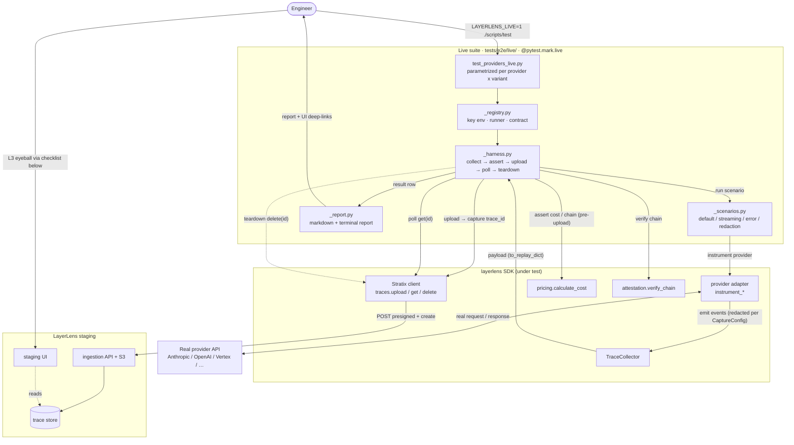

# Live adapter verification (runbook)

Automated **L1 + L2** verification for the provider adapters, plus the checklist for the
manual **L3** pass. This suite makes **real provider SDK calls** and uploads to a **real
(staging) LayerLens backend** — it is opt-in and never runs in CI.

- **L1** — real SDK + real key + real LayerLens client run a canonical agentic workflow.
- **L2** — read the trace back from the backend and confirm it landed.
- **L3** — open the trace in the UI and confirm it renders sensibly (this runbook).

Unlike the sibling `tests/e2e/` suite (real frameworks, *mocked* LLM + client), this one hits
real providers and a real backend.

## Architecture



## 1. Prerequisites

Install the provider extras you want to exercise, e.g.:

```bash
pip install 'layerlens[anthropic]' 'layerlens[openai]'   # etc.
```

LayerLens (staging) + suite controls:

| Env var | Purpose |
| --- | --- |
| `LAYERLENS_LIVE=1` | Opt the suite in (or pass `-m live`). Without it every test skips. |
| `LAYERLENS_STRATIX_API_KEY` | Staging API key. |
| `LAYERLENS_STRATIX_BASE_URL` | **Staging** base URL. Required — the suite refuses to run against the default (prod) URL. |
| `LAYERLENS_APP_BASE_URL` | UI base for report deep-links (default `https://app.layerlens.ai`). |
| `LAYERLENS_LIVE_COST_CAP_USD` | Per-test spend ceiling (default `0.25`); a test fails if its run exceeds it. |

Per provider (set the key(s) for the providers you want; others skip):

| Provider | Required env | Optional model override |
| --- | --- | --- |
| anthropic | `ANTHROPIC_API_KEY` | `LL_ANTHROPIC_MODEL` |
| openai | `OPENAI_API_KEY` | `LL_OPENAI_MODEL` |
| azure_openai | `AZURE_OPENAI_ENDPOINT`, `AZURE_OPENAI_API_KEY` | `AZURE_OPENAI_API_VERSION`, `AZURE_OPENAI_DEPLOYMENT` |
| google_vertex | `GOOGLE_APPLICATION_CREDENTIALS` *or* `GOOGLE_CLOUD_PROJECT` | `LL_VERTEX_MODEL` |
| bedrock | `AWS_ACCESS_KEY_ID` *or* `AWS_PROFILE` (+ `AWS_REGION`) | `LL_BEDROCK_MODEL` |
| ollama | `OLLAMA_HOST` (e.g. `http://localhost:11434`) + a running `ollama serve` | `OLLAMA_MODEL` |
| litellm | one of `OPENAI_API_KEY` / `ANTHROPIC_API_KEY` / `LITELLM_API_KEY` | `LITELLM_MODEL` |

## 2. Run L1+L2

One provider:

```bash
LAYERLENS_LIVE=1 \
LAYERLENS_STRATIX_BASE_URL=<staging-url> LAYERLENS_STRATIX_API_KEY=<key> \
ANTHROPIC_API_KEY=<key> \
./scripts/test tests/e2e/live -k anthropic
```

Everything available:

```bash
LAYERLENS_LIVE=1 LAYERLENS_STRATIX_BASE_URL=<staging-url> LAYERLENS_STRATIX_API_KEY=<key> \
  <provider keys...> ./scripts/test tests/e2e/live
```

- **skip** = that provider's SDK or credentials aren't present (expected; not a failure).
- **fail** = a real problem — a broken contract, a rejected upload, a cost mismatch, a redaction leak.

### First run is a spike

The first time you run against staging, confirm two unknowns (they shape what L2 can assert):

1. **Upload accepted?** A passing test already proves it — `traces.upload` returned a `trace_id`
   (the harness fails loudly otherwise). If uploads are rejected, the backend wants a different
   trace schema than the SDK's instrumentation payload and we need a serializer.
2. **Does `trace.get(id).data` echo the events back?** Check the `Data echo` column in the report.
   `yes` means the round-trip also re-checks the event count; `no` is fine — the deep checks all
   ran on the local payload regardless.

## 3. Read the report

Each run writes `tests/e2e/live/.report/live-run-<UTC>.md` (git-ignored) and prints a terminal
summary. One row per provider x variant: model, event counts/types, tool-call count, total cost,
redaction/attestation status, data-echo, and a **deep-link** to the trace in the UI.

> The UI trace path is templated from `LAYERLENS_APP_BASE_URL` and may need adjusting — the raw
> `trace_id` / org / project are always in the report so the trace is locatable regardless.

## 4. L3 manual checklist (per trace)

Open each report link in the staging UI. Most facts are **already proven** by L2; you're confirming
the UI reflects them and reads sensibly.

Already automated (just confirm the UI shows it):

- [ ] event count & types match the report row
- [ ] cost matches the report's computed cost
- [ ] redaction held — no raw prompt text on the `redaction` variant
- [ ] attestation verified (chain intact after ingestion)
- [ ] `ttft_ms` present on the `streaming` variant
- [ ] `agent.error` captured on the `error` variant

Human judgment (not automated — this is the point of L3):

- [ ] span tree / ordering reads correctly
- [ ] token counts look sane (prompt/completion, cached/thinking/reasoning where relevant)
- [ ] tool calls render with legible name/args (tool providers)
- [ ] timestamps / latency look plausible
- [ ] nothing renders broken or mislabeled

## 5. Troubleshooting

- **`trace not found after polling`** — backend persistence lag; raise the poll attempts/delay in
  `_harness._poll_get`, or confirm staging ingestion is healthy.
- **`upload returned no trace_ids`** — the backend rejected the instrumentation schema (see the
  spike note). A serializer to the documented trace schema is needed before `upload()`.
- **`cost.record has unpriced cost_usd`** — the model isn't in the pricing table; add it or set
  `LAYERLENS_PRICING_TABLE`. (ollama is expected to be unpriced and is tolerated.)
- **`run cost exceeded cap`** — a scenario used more tokens than expected; check the prompts or
  raise `LAYERLENS_LIVE_COST_CAP_USD`.
- **auth / base-url errors at fixture setup** — `LAYERLENS_STRATIX_API_KEY` /
  `LAYERLENS_STRATIX_BASE_URL` missing or wrong.

## 6. Record results

Per adapter, mark the L3 pass:

```
anthropic     [ ] pass  [ ] fail   notes:
openai        [ ] pass  [ ] fail   notes:
azure_openai  [ ] pass  [ ] fail   notes:
google_vertex [ ] pass  [ ] fail   notes:
bedrock       [ ] pass  [ ] fail   notes:
ollama        [ ] pass  [ ] fail   notes:
litellm       [ ] pass  [ ] fail   notes:
```
